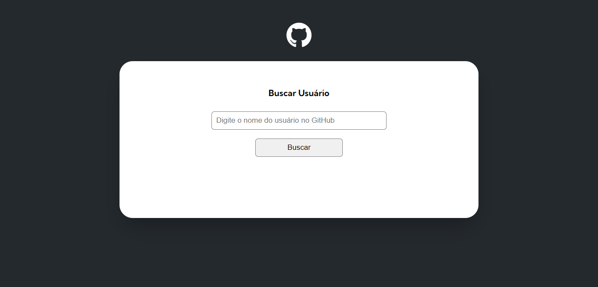
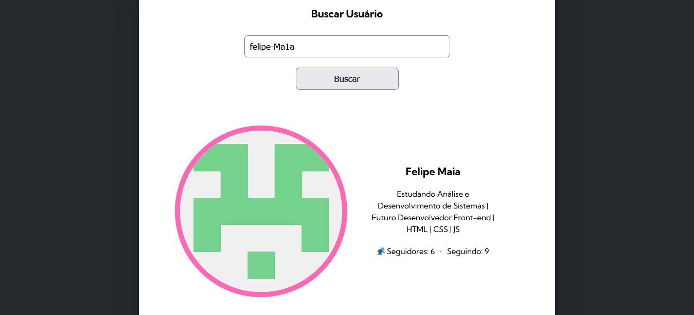
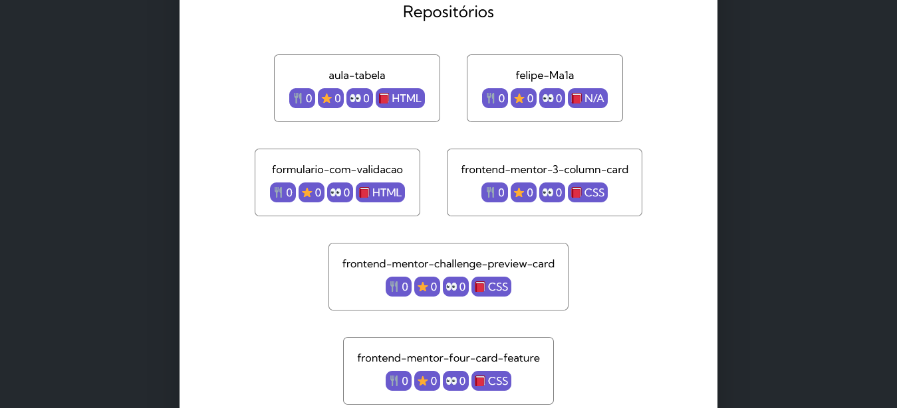
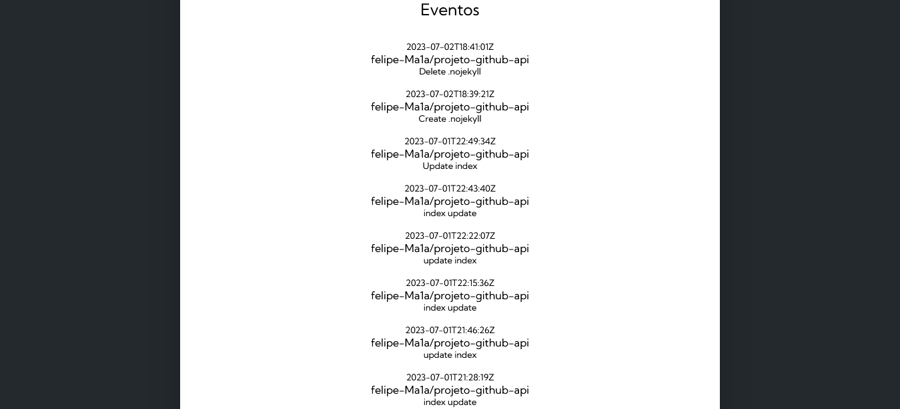

# 🐱 GitHub API 

O projeto foi feito para treinar JavaScript e aprender como utilizar uma API.

 

## Conteúdo

  - [Informações do usuário](#informações-do-usuário)
  - [Repositório](#repositórios)
  - [Eventos](#eventos)
  - [Tecnologias](#tecnologias)
  - [Link](#link)

   

## Informações do usuário

Assim que o nome do usuário for pesquisado você ja irá observar algumas informações do perfil como: Foto, nome, bio e número de seguidores. 

 

## Repositórios

Logo abaixo terá uma seção com 10 repositórios do usuário, em cada um você vai conseguir ver o número de forks, stars, watcher's e a principal linguagem utilizada no projeto.

 

## Eventos

Por último, na seção de eventos irá aparecer as últimas 10 alterações feitas em repositórios do usuário.

 

### Tecnologias

- GitHub API
- JavaScript

 

### Link

Para ver o projeto no Vercel: <a href="https://projeto-github-api.vercel.app/"><u>Clique aqui</u></a>
